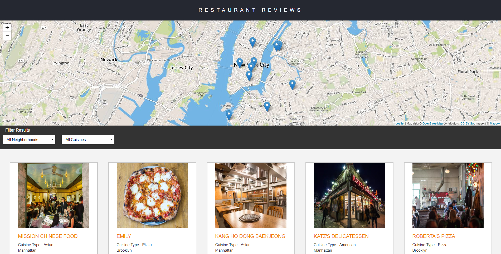

# Udacity-Restaurant-Reviews-App 
This repository is the code that I created during the Udacity Restaurant Reviews App. THe project uses the MapBox API and provided Json data to map information about restaurants.

# Demo
Currently this project is not available through Github Pages function because it can not import Json file because of HTTPS problem. The live version of this project will be hosted on my RaspberryPi server in the future. But if you have a basic web server program like Apache server, you can simply download the project and connect to the set port. If this project is uploaded to my web server, the README.md file will be updated.

# What I learned
I was able to learn how to modify an already developed project in a more desired way and to become familiar with how to use the provided API and Json file to provide data on the website and improve the website with responsive web design there was. I also learned how to use Service Woker to provide cached data to users, even if the network status is offline.

# Installation
You can download with this [link](https://github.com/sangumee/Udacity-Restaurant-Reviews-App/archive/master.zip) and install in your web server. If you already installed the Visual Studio Code or Github Program, You can access it directly with these programs.

# Contact
If you have some questions or issues about this repository please contact me with the [Issue](https://github.com/sangumee/Udacity-Restaurant-Reviews-App/issues) section.

# Used Library

[MapBox](https://www.mapbox.com/)  
MapBox API Key is in the source code but you should not use it. It's only for the testing purpose. If you want the API, you can get it [here](https://www.mapbox.com/).

# License
This project is released under the [MIT License](https://choosealicense.com/licenses/mit/). If you think there is a problem with this license, please file an issue through the Issue section.
